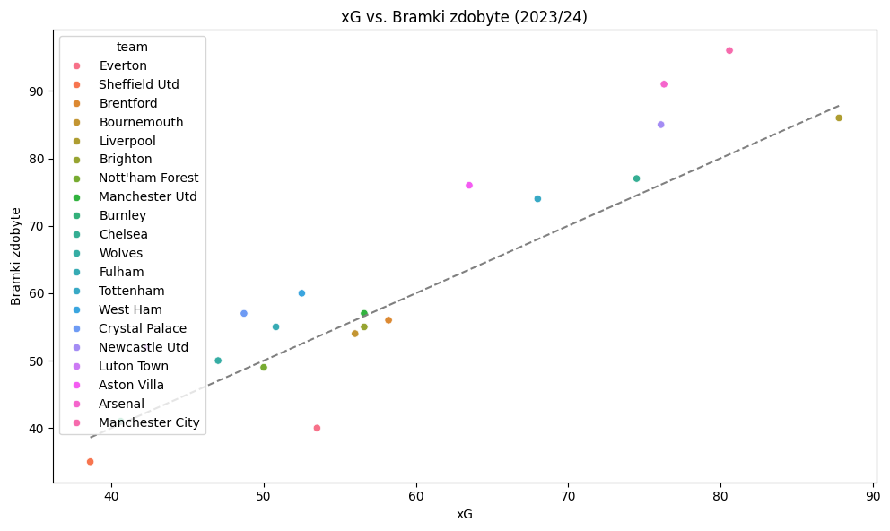
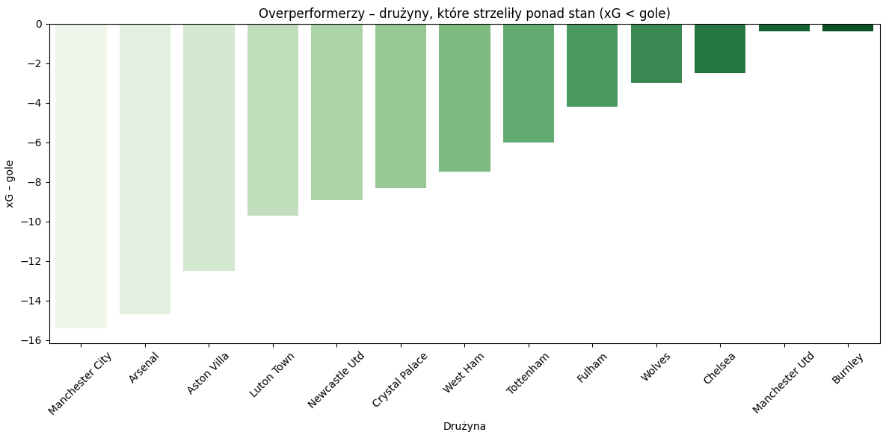
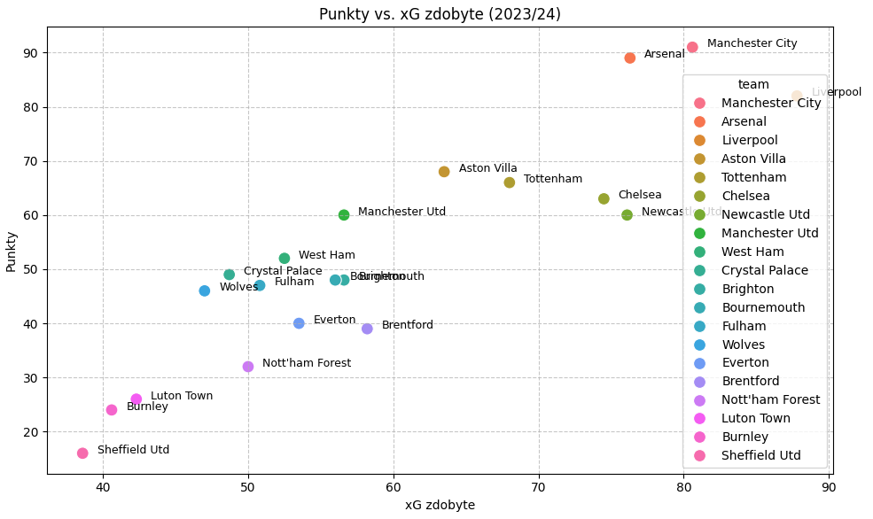
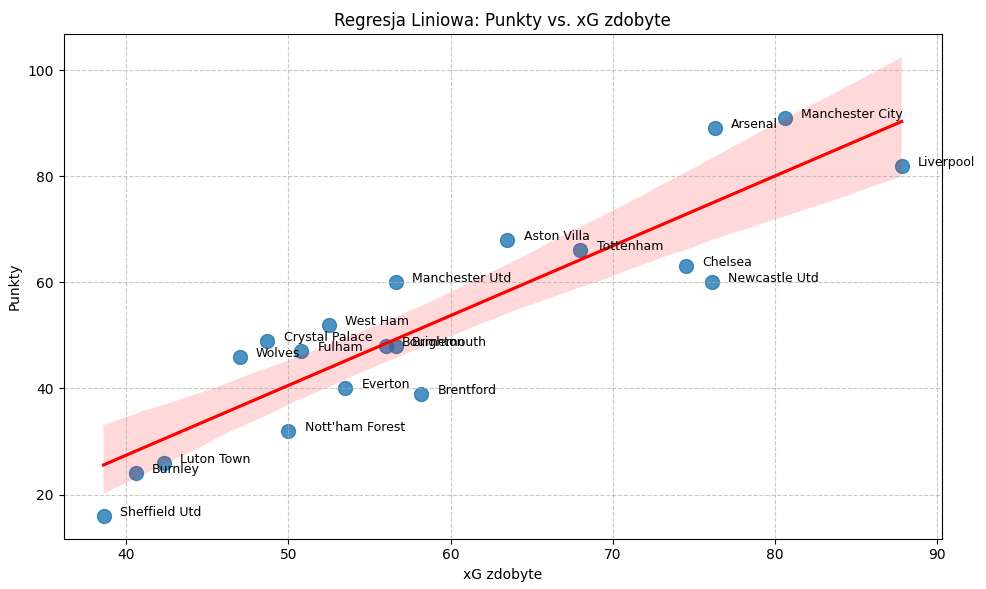
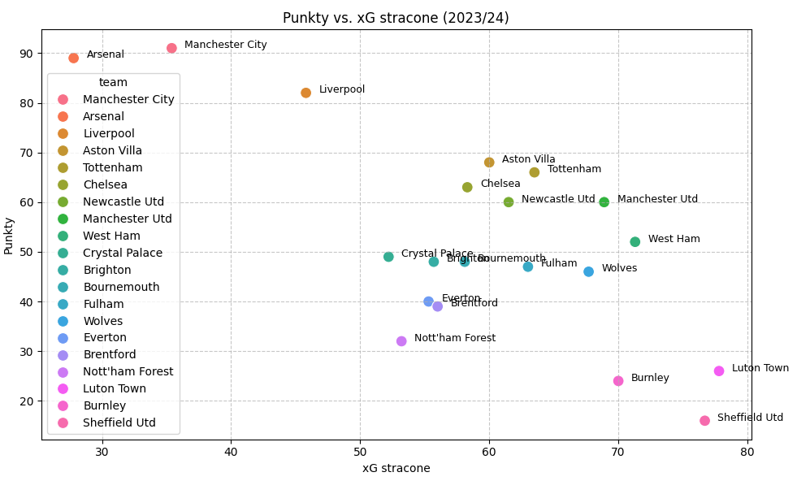
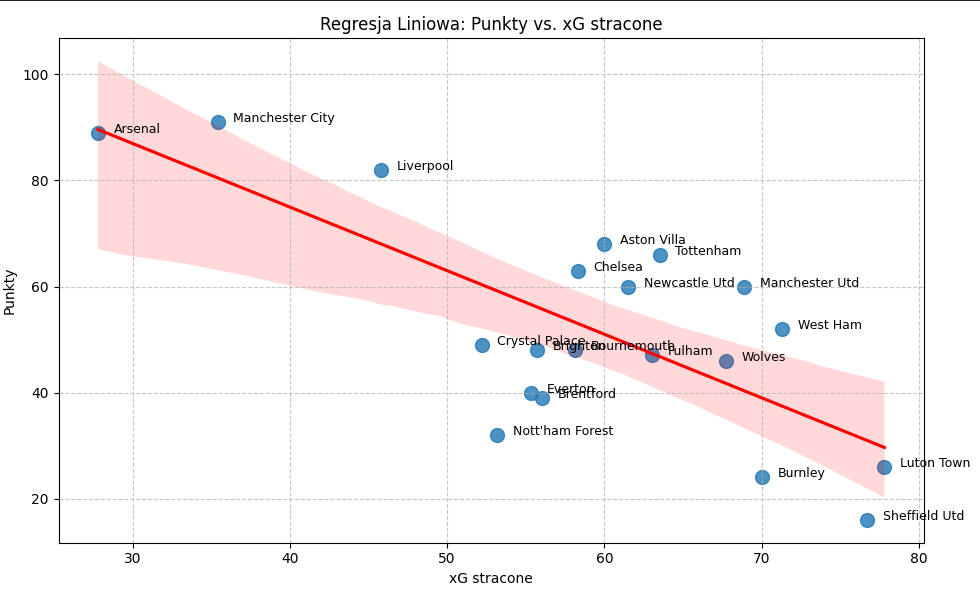
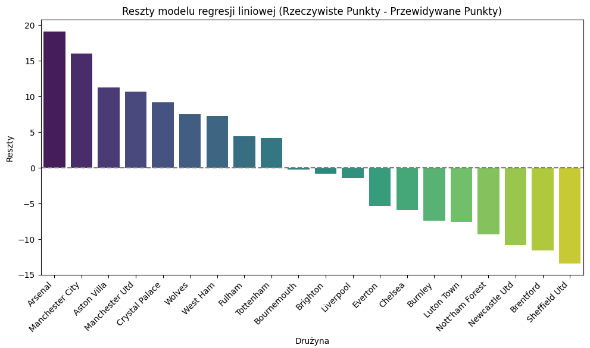

# Premier-League-xG-Analysis
Projekt analizujący sezon Premier League 2023/24 z naciskiem na metrykę xG. Bada korelację xG z golami i punktami. Wykorzystuje Python (Pandas, Matplotlib, Seaborn, SciPy, Scikit-learn) do czyszczenia, wizualizacji, korelacji i regresji liniowej. Identyfikuje drużyny "overperforming" i "underperforming", dostarczając wglądu w ich efektywność.
# Analiza Danych Premier League 2023/24: Wpływ xG (Expected Goals) na Wyniki Zespołów

## Spis treści
- [Wprowadzenie](#wprowadzenie)
- [Cel Projektu](#cel-projektu)
- [Źródło Danych](#źródło-danych)
- [Wykorzystane Technologie](#wykorzystane-technologie)
- [Kluczowe Kroki Analizy](#kluczowe-kroki-analizy)
- [Wnioski i Wyniki](#wnioski-i-wyniki)
- [Jak uruchomić projekt](#jak-uruchomić-projekt)
- [Kontakt](#kontakt)

## Wprowadzenie

Ten projekt to kompleksowa analiza danych dotyczących sezonu Premier League 2023/2024, skupiająca się na metryce **xG (Expected Goals)**, czyli oczekiwanych bramkach. xG to zaawansowany wskaźnik, który mierzy jakość sytuacji strzeleckich, przypisując im prawdopodobieństwo zakończenia się golem, na podstawie wielu czynników (m.in. pozycja strzału, typ asysty, część ciała, odległość od bramki, kąt). Analiza ta pozwala na głębsze zrozumienie, czy wyniki osiągane przez drużyny są zgodne z jakością stwarzanych i dopuszczanych okazji.

## Cel Projektu

Głównym celem projektu jest zbadanie:
- Jak **xG** koreluje z rzeczywistą liczbą strzelonych i straconych goli.
- Które drużyny "underperformowały" (strzeliły mniej niż wynikałoby z ich xG) i "overperformowały" (strzeliły więcej niż wynikałoby z ich xG) pod względem ofensywnym i defensywnym.
- Czy metryka **xG** ma istotny wpływ na liczbę zdobytych punktów przez drużyny w trakcie sezonu.

## Źródło Danych

Dane meczowe z sezonu Premier League 2023/2024 zostały pobrane z platformy [Kaggle](https://www.kaggle.com/datasets/orkunaktas/english-premier-league-epl-results-2023-24?utm_source=chatgpt.com). Plik `premier-League-24.csv` zawiera szczegółowe statystyki meczowe, w tym wartości xG dla każdej drużyny w każdym meczu. Końcowa tabela ligowa z punktami została wprowadzona ręcznie do analizy.

## Wykorzystane Technologie

* **Python**: Główny język programowania.
* **Pandas**: Do manipulacji i analizy danych.
* **Matplotlib**: Do tworzenia statycznych wizualizacji danych.
* **Seaborn**: Do tworzenia atrakcyjnych i informatywnych wykresów statystycznych.
* **SciPy**: Do obliczania korelacji (Pearsonr).
* **Scikit-learn**: Do budowy i oceny modelu regresji liniowej.

## Kluczowe Kroki Analizy

1.  **Wczytanie i Czyszczenie Danych**: Import danych, obsługa brakujących wartości, rozdzielenie kolumny `Score` na gole gospodarzy i gości.
2.  **Przygotowanie Danych Zespołowych**: Agregacja danych dla każdej drużyny, zsumowanie goli, xG, xGA (expected goals against).
3.  **Obliczenie Różnic xG**: Stworzenie metryk `xG_diff` (xG zdobyte - gole zdobyte) oraz `xGA_diff` (xGA - gole stracone) w celu identyfikacji under/overperformerów.
4.  **Identyfikacja Under/Overperformerów**: Wizualizacja i prezentacja drużyn, które strzeliły/straciły mniej/więcej goli niż wskazywałoby na to ich xG.
5.  **Analiza Korelacji**: Obliczenie współczynników korelacji Pearsona pomiędzy różnymi metrykami xG a liczbą punktów, aby ocenić siłę związku.
6.  **Model Regresji Liniowej**: Zbudowanie modelu regresji liniowej w celu przewidywania punktów na podstawie xG zdobytych i straconych, oraz ocena jego dokładności (R-kwadrat, MSE).
7.  **Analiza Reszt**: Identyfikacja drużyn, których rzeczywiste wyniki punktowe znacząco odbiegają od przewidywań modelu regresji.

## Wnioski i Wyniki

### Korelacja
Analiza korelacji wykazała:
* **Silną pozytywną korelację** między **xG zdobytych** a liczbą punktów, co sugeruje, że im więcej jakościowych okazji drużyna tworzy, tym więcej punktów zdobywa.
* **Silną negatywną korelację** między **xGA (xG straconych)** a liczbą punktów, co oznacza, że im więcej jakościowych okazji drużyna dopuszcza, tym mniej punktów zdobywa.
* Korelacja dla `xG_diff` i `xGA_diff` w stosunku do punktów również wskazuje na istotny związek.

### Over/Underperformerzy
Wykresy słupkowe jasno ilustrują, które drużyny "miały szczęście" (overperformowały, np. strzelały z gorszych pozycji, ale często trafiały) oraz które "miały pecha" (underperformowały, np. tworzyły dużo dobrych okazji, ale ich nie wykorzystywały).

### Regresja Liniowa
Model regresji liniowej pokazuje, że **xG (zarówno zdobyte, jak i stracone) jest dobrym predyktorem liczby punktów**. Współczynnik R-kwadrat wskazuje na to, jaki procent zmienności punktowej jest wyjaśniony przez te metryki xG. Analiza reszt pozwoliła zidentyfikować drużyny, które znacząco odstają od tego trendu – czy to przez wyjątkową skuteczność, czy też przez pecha.

Ogólne wnioski potwierdzają, że metryka xG jest cennym narzędziem do oceny jakości gry drużyny i może być dobrym wskaźnikiem przyszłych wyników.
## Wizualizacje Kluczowych Wyników

Poniżej przedstawiono wybrane wizualizacje z analizy, ilustrujące główne wnioski.

### xG vs. Bramki zdobyte (2023/24)
Ten wykres punktowy przedstawia zależność między sumą oczekiwanych goli (xG) a rzeczywistą liczbą strzelonych bramek dla każdej drużyny. Linia przerywana symbolizuje idealne dopasowanie (xG = gole). Punkty powyżej linii oznaczają "overperformerów", a poniżej linii "underperformerów".



### Underperformerzy – drużyny, które powinny strzelić więcej (xG > gole)
Wykres słupkowy prezentujący drużyny, których rzeczywista liczba strzelonych goli była niższa niż ich Expected Goals (xG). Wskazuje to na niewykorzystany potencjał ofensywny lub pecha w wykończeniu akcji.


### Overperformerzy – drużyny, które strzeliły ponad stan (xG < gole)
Wykres słupkowy pokazujący drużyny, które strzeliły więcej goli niż wynikałoby z ich Expected Goals (xG). Może to świadczyć o wyjątkowej skuteczności, szczęściu, lub skuteczności w wykańczaniu trudniejszych sytuacji.



### Punkty vs. xG zdobyte (2023/24)
Wykres punktowy przedstawiający relację między sumą zdobytych punktów a łączną wartością Expected Goals zdobytych dla każdej drużyny. Wskazuje na ogólny trend, że drużyny z wyższym xG_for zazwyczaj zdobywają więcej punktów.



### Regresja Liniowa: Punkty vs. xG zdobyte
Wykres ten wizualizuje linię regresji liniowej dopasowaną do danych Punktów vs. xG zdobytych, wraz z obszarem ufności. Pokazuje, jak dobrze xG zdobyte przewiduje liczbę punktów.



### Punkty vs. xG stracone (2023/24)
Wykres punktowy ilustrujący związek między sumą zdobytych punktów a łączną wartością Expected Goals straconych (xGA) przez każdą drużynę. Zazwyczaj drużyny, które tracą mniej xGA, zdobywają więcej punktów.



### Regresja Liniowa: Punkty vs. xG stracone
Wykres przedstawiający linię regresji liniowej dla Punktów vs. xG straconych. Pomaga zrozumieć, jak bardzo dopuszczanie jakościowych okazji bramkowych wpływa na liczbę zdobytych punktów.



### Reszty modelu regresji liniowej (Rzeczywiste Punkty - Przewidywane Punkty)
Wykres słupkowy reszt z modelu regresji. Dodatnie reszty oznaczają, że drużyna zdobyła więcej punktów niż przewidywał model na podstawie xG, natomiast ujemne reszty wskazują na to, że drużyna zdobyła mniej punktów niż przewidywano.



---


## Jak uruchomić projekt

1.  **Sklonuj repozytorium:**
   ```bash
    git clone [https://github.com/SzymonSzulik47/Premier-League-xG-Analysis.git](https://github.com/SzymonSzulik47/Premier-League-xG-Analysis.git)
    cd Premier-League-xG-Analysis
   ```
2.  **Zainstaluj wymagane biblioteki:**
 ```bash
    pip install pandas matplotlib seaborn scipy scikit-learn
  ```
3.  **Pobierz dane:**
    Upewnij się, że plik `premier-League-24.csv` znajduje się w tym samym katalogu co skrypt Pythona. Możesz go pobrać z [Kaggle](https://www.kaggle.com/datasets/orkunaktas/english-premier-league-epl-results-2023-24?utm_source=chatgpt.com)
4.  **Uruchom skrypt:**
    ```bash
    python epl_Xg_2023_24.py
    ```

## Kontakt

Masz pytania lub sugestie? Skontaktuj się ze mną:
* LinkedIn: [LinkedIn](https://www.linkedin.com/in/szymon-szulik-142144344)
* Email: [szymonszulik17@gmail.com]
